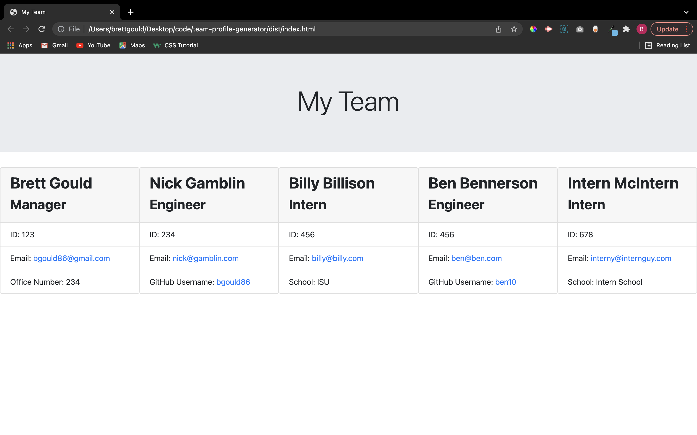

# 10 Object-Oriented Programming: Team Profile Generator 

## Description

Build a Node.js command-line application that takes in information about employees on a software engineering team, then generates an HTML webpage that displays summaries for each person.

## Table of Contents

- [Screenshot](#screenshot)
- [Installation](#installation)
- [Usage](#usage)
- [Contribute](#contribute)
- [Tests](#tests)
- [Questions](#questions)
- [Links](#links)
- [License](#license)

## Screenshot

## Installation

User must install inquirer for application to work and must install jest for tests to work.

## Usage

Use this application to build team profiles.

## Contribute

Contact the application owner.

## Tests

Run the tests.

## Questions

If you have any questions, please contact:

- Brett Gould
- bgould86@gmail.com
- [https://www.github.com/bgould86](https://www.github.com/bgould86)

## Links

- Here is the repo: [https://github.com/bgould86/team-profile-generator](https://github.com/bgould86/team-profile-generator)
- Here is the video walk through: [https://www.youtube.com/watch?v=E0dODUwx6Co](https://www.youtube.com/watch?v=E0dODUwx6Co)

## License

This project is licnesed by the MIT license.
